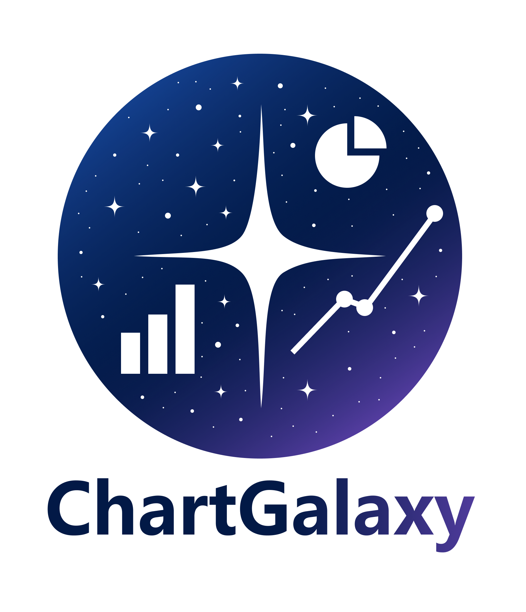
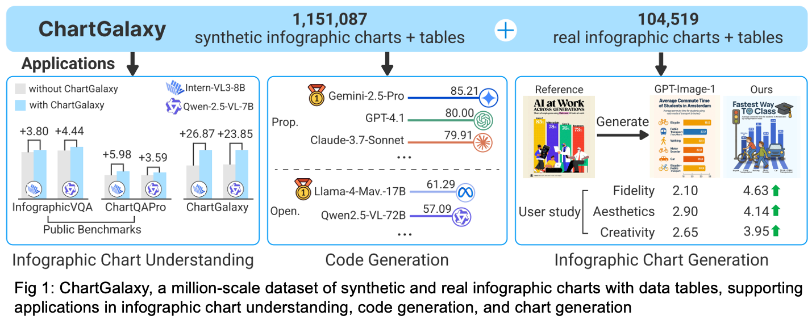
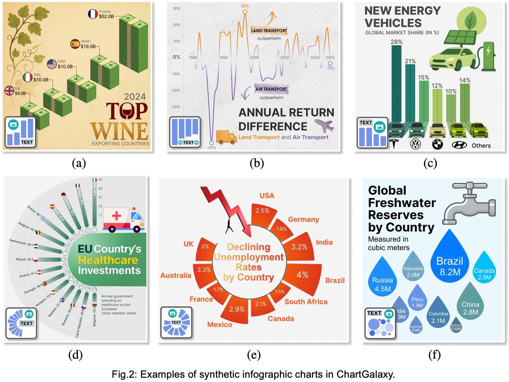

<div align=center>
  
</div>

# ChartGalaxy: A Dataset for Infographic Chart Understanding and Generation

<!--  -->

<!-- This is the official code repository of the paper "[ChartGalaxy: A Dataset for Infographic Chart Understanding and Generation](https://arxiv.org/abs/2505.18668)".  -->

<p align="center">
  <a href="https://arxiv.org/abs/2505.18668">
    
  </a>
  <a href="https://huggingface.co/datasets/ChartGalaxy/ChartGalaxy">
    
  </a>
</p>

> ChartGalaxy is a million-scale dataset of synthetic and real infographic charts with data tables, supporting applications in infographic chart understanding, code generation, and chart generation. The dataset addresses the challenge that existing datasets are mostly limited to plain charts, failing to capture the diverse range of design styles and layouts that are key characteristics of infographic charts.



## 🔥 News
[2025.6] 🎉🎉 We are excited to announce a new release of our dataset! This update includes an additional 230,217 synthetic infographic charts, bringing the total number of chart variations to 440.

[2025.5] 🎉🎉 We have released the first version of our dataset, which includes 1,151,087 synthetic and 104,519 real infographic charts, covering 75 chart types and 330 variations.

## 📦 Dataset
**[👉 Access the full ChartGalaxy dataset on Hugging Face 🤗! 👈](https://huggingface.co/datasets/ChartGalaxy/ChartGalaxy)**

Due to storage limitations, we only include a collection of representative examples below (and more in [examples](examples)). 




<!-- ## Introduction

### About -->

### 📊 Statistics

- **Size**: 1,151,087 infographic charts (1,151,087 synthetic + 104,519 real)
- **Content**: Each infographic chart is paired with the tabular data used to create it
- **Chart Types**: 75 chart types with 330 chart variations
- **Layout Templates**: 68 layout templates

### 🚀 Data Collection and Creation

ChartGalaxy was constructed through:

1. **Real Infographic Chart Collection**: Charts were collected from 19 reputable chart-rich websites, such as Pinterest, Visual Capitalist, Statista, and Information is Beautiful.

2. **Synthetic Infographic Chart Creation**: Following an inductive structuring process that:
   - Identifies 75 chart types (e.g., bar charts) and 330 chart variations reflecting different visual element styles
   - Extracts 68 layout templates defining spatial relationships among elements
   - Programmatically generates synthetic charts based on these patterns

## 🎯 Applications

The utility of ChartGalaxy is demonstrated through three representative applications:

### 🧠 Infographic Chart Understanding

Fine-tuning on ChartGalaxy improves the performance of foundation models on infographic chart understanding. 

**We provide the code and data for the evaluation introduced in our paper ([**code**](code_understanding), [**data**](https://huggingface.co/datasets/ChartGalaxy/ChartGalaxy/blob/main/eval_data.zip)).**

### 💻 Infographic Chart Code Generation

A benchmark for assessing LVLMs' code generation for infographic charts. The benchmark evaluates the similarity between charts rendered by the generated D3.js code and ground-truth ones at two levels of granularity: high-level (overall visual similarity) and low-level (average similarity across fine-grained SVG elements).

**We provide the code and data for the constructed benchmark introduced in our paper ([**benchmark**](code_generation_benchmark)).**


### 🖼️ Example-based Infographic Chart Generation

An example-based method that transforms user-provided tabular data into an infographic chart, aligning with the layout and visual style of a given example chart. User studies show this method outperforms GPT-Image-1 on fidelity, aesthetics, and creativity.

**We provide the code for the example-based infographic chart generation introduced in our paper ([**code**](example_based_generation)).**

## ⚖️ License
This project is released under the [Apache 2.0 license](LICENSE).

## 📚 Citation
If you find our work helpful for your research, please consider citing the following BibTeX entry.
```
@article{li2025chartgalaxy,
  title={{ChartGalaxy}: A Dataset for Infographic Chart Understanding and Generation},
  author={Li, Zhen and Guo, Yukai and Li, Duan and Guo, Xinyuan and Li, Bowen and Xiao, Lanxi and Qiao, Shenyu and Chen, Jiashu and Wu, Zijian and Zhang, Hui and Shu, Xinhuan and Liu, Shixia},
  journal={arXiv preprint arXiv:2505.18668},
  year={2025}
}
```

## ✨ Related Projects
- **OrionBench: A Benchmark for Chart and Human-Recognizable Object Detection in Infographics**  
[Paper](https://arxiv.org/abs/2505.17473) | [Code](https://github.com/OrionBench/OrionBench/) | [Dataset](https://huggingface.co/datasets/OrionBench/OrionBench)

- **InfoChartQA: A Benchmark for Multimodal Question Answering on Infographic Charts**  
[Paper](https://arxiv.org/abs/2505.19028) | [Code](https://github.com/CoolDawnAnt/InfoChartQA) | [Dataset](https://huggingface.co/datasets/Jietson/InfoChartQA)


## 🤝 Contact
- chartgalaxy@163.com
